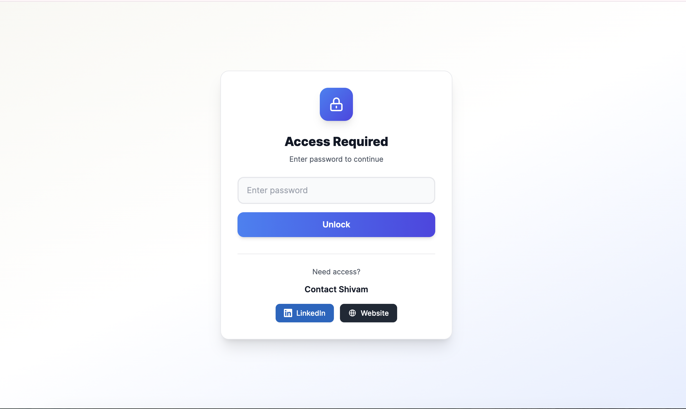
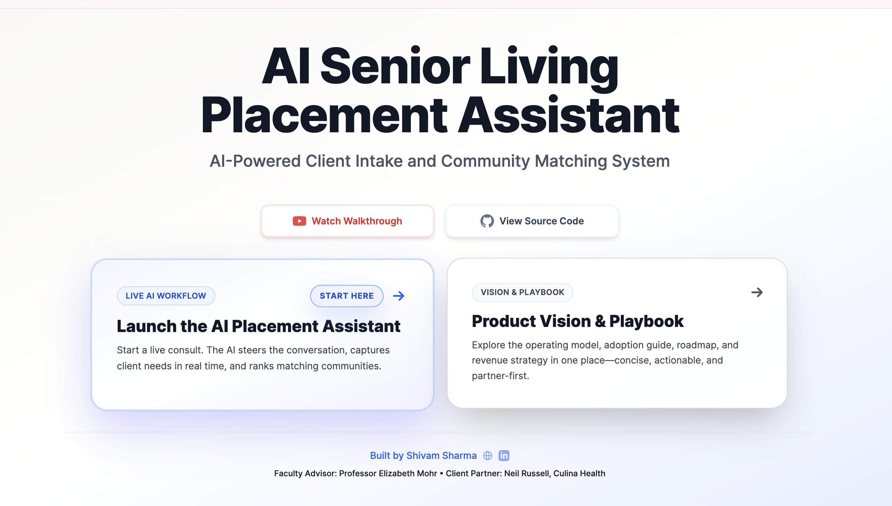
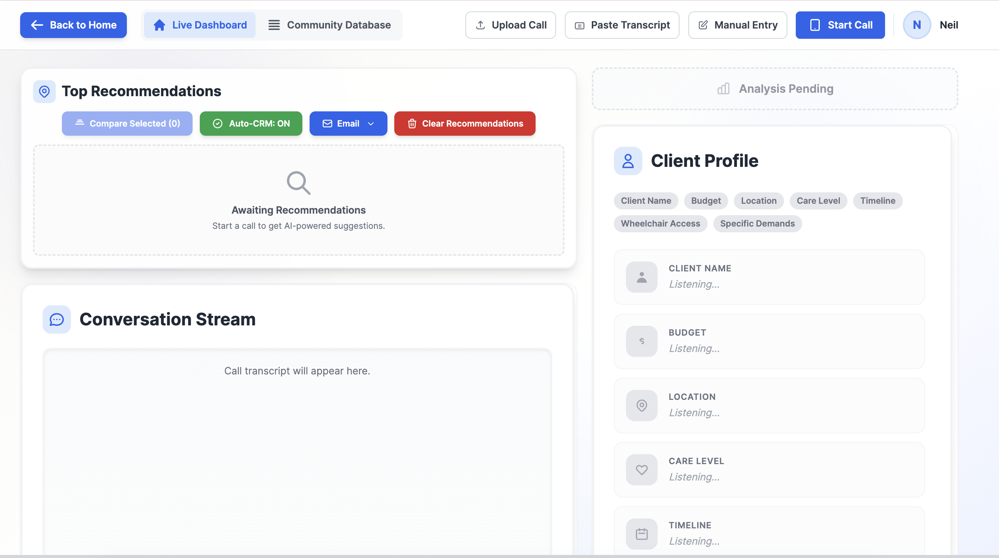
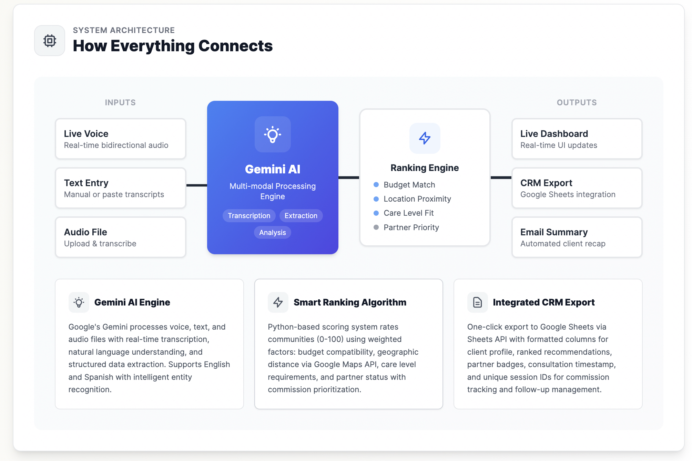

# 🚀 AI Senior Living Placement Assistant

<div align="center">


**Enterprise-grade AI assistant for senior living placement professionals**  
Real-time conversations • Intelligent matching • Automated CRM • Secure & scalable

🌐 [Live Demo](#) • 📖 [Documentation](#-quick-start) • 🚀 [Deploy to Render](#-deployment-to-render)

</div>

---

## 📸 **Application Screenshots**

<div align="center">

### **🔐 Secure Access**


*Enterprise-grade password protection ensures secure access to sensitive client data*

---

### **🏠 Professional Landing Page**


*Clean, intuitive interface offering multiple consultation modes - Live Call, Audio Upload, Text Input, and Manual Entry*

---

### **🎙️ Live AI Dashboard** *(Where the Magic Happens)*


*Real-time AI conversations with live transcription, dynamic client profile extraction, intelligent recommendations, and automatic CRM integration*

---

### **🏗️ Enterprise Architecture**


*Scalable, production-ready architecture with React frontend, Flask backend, Google Gemini AI, and Google Cloud services*

</div>

---

## ✨ **What Makes This Special**

🎙️ **Live AI Conversations** - Natural, real-time consultations powered by Google Gemini 2.5 Flash  
🧠 **8-Dimensional Matching** - Advanced algorithm considering budget, location, care needs, and more  
📈 **Automated CRM** - Instant Google Sheets integration for seamless lead management  
🔒 **Enterprise Security** - Password protection, secure API access, and encrypted data handling  
⚡ **Ultra-Responsive** - <150ms transcription latency for natural conversation flow

---

## 🎯 **Core Features**

### **🎙️ Multiple Consultation Modes**
- **Live Voice Call** - Real-time AI-powered conversations with automatic transcription
- **Audio Upload** - Process pre-recorded consultation audio files (.m4a, .wav, .mp3)
- **Text Input** - Paste consultation transcripts or conversation notes
- **Manual Entry** - Direct client profile input for quick recommendations

### **🤖 Intelligent AI Capabilities**
- **Context-Aware Conversations** - Natural dialogue flow with memory of previous exchanges
- **Smart Question Suggestions** - AI guides consultants to gather complete client profiles
- **Automatic Profile Extraction** - Extracts name, budget, location, care needs, timeline, and special requirements
- **Real-Time Guidance** - Live coaching tips for consultants during calls

### **📊 Advanced Matching Algorithm**

**8-Dimensional Ranking System:**
1. 💰 **Budget Optimization** - Finds best value within price constraints
2. 📍 **Geographic Proximity** - Calculates distance from preferred locations
3. 🏥 **Care Level Matching** - Matches required care capabilities (Independent Living, Assisted Living, Memory Care)
4. 🏠 **Amenity Alignment** - Prioritizes desired features and facilities
5. ⏰ **Timeline Urgency** - Considers immediate availability vs. future needs
6. 👥 **Accommodation Type** - Handles couples, families, and individual requirements
7. ♿ **Accessibility Needs** - Wheelchair, mobility, and special assistance requirements
8. 🏆 **Business Value** - Optimizes for partner communities and commission potential

### **📈 Enterprise CRM Integration**
- **Automatic Logging** - Every consultation saved to Google Sheets
- **Real-Time Sync** - Instant updates with timestamps and agent info
- **Performance Analytics** - Track conversion rates, response times, and AI accuracy
- **Export-Ready Reports** - Client summaries formatted for follow-up

### **🔒 Security & Compliance**
- **Password Protection** - Secure application access
- **Environment Variables** - Sensitive data never committed to Git
- **CORS Security** - Proper origin validation for API access
- **Service Account Auth** - Secure Google Cloud integration

---

## 🚀 **Quick Start**

### **One-Command Setup** (Local Development)

```bash
# Clone and setup
git clone https://github.com/your-username/AI-Sales-Assistant.git
cd AI-Sales-Assistant

# Install all dependencies
cd backend && python -m venv venv && source venv/bin/activate && pip install -r requirements.txt && cd ..
cd frontend && npm install && cd ..

# Configure environment variables (see below)
# Then start everything:
./start.sh
```

🎉 **Application runs at:** `http://localhost:3000`

---

## 📋 **Installation & Setup**

### **Prerequisites**
- ✅ Python 3.11+
- ✅ Node.js 20+
- ✅ Google Gemini API Key ([Get one here](https://makersuite.google.com/app/apikey))
- ✅ Google Cloud Service Account (for CRM integration)

### **Backend Configuration**

1. **Create virtual environment:**
   ```bash
   cd backend
   python -m venv venv
   source venv/bin/activate  # Windows: venv\Scripts\activate
   pip install -r requirements.txt
   ```

2. **Create `.env` file in backend directory:**
   ```bash
   GEMINI_API_KEY=your_gemini_api_key_here
   GOOGLE_SPREADSHEET_ID=your_google_sheet_id
   GOOGLE_SERVICE_ACCOUNT_FILE=your-service-account.json
   DATA_FILE=DataFile_students_OPTIMIZED.xlsx
   FRONTEND_ORIGIN=http://localhost:3000
   ```

3. **Setup Google Sheets CRM:**
   - Create service account in [Google Cloud Console](https://console.cloud.google.com)
   - Download JSON key and place in `backend/` directory
   - Share your Google Sheet with service account email
   - See [ENABLE_APIS.md](backend/ENABLE_APIS.md) for detailed steps

### **Frontend Configuration**

1. **Install dependencies:**
   ```bash
   cd frontend
   npm install
   ```

2. **Create `.env` file in frontend directory:**
   ```bash
   VITE_API_BASE_URL=http://localhost:5050
   VITE_GEMINI_API_KEY=your_gemini_api_key_here
   VITE_APP_PASSWORD=your_secure_password
   ```

### **Start Development Servers**

**Option A: Single Command**
```bash
./start.sh
```

**Option B: Manual Start**

*Terminal 1 - Backend:*
```bash
cd backend
source venv/bin/activate
python app.py
```

*Terminal 2 - Frontend:*
```bash
cd frontend
npm run dev
```

Access at: `http://localhost:3000` ✨

---

## 🌐 **Deployment to Render**

### **Step 1: Prepare Repository**

1. **Update `.gitignore`** to exclude sensitive files:
   ```gitignore
   # Environment files
   .env
   .env.local
   .env.production
   
   # Service accounts
   *.json
   !package.json
   !package-lock.json
   !tsconfig*.json
   
   # Logs and caches
   *.log
   __pycache__/
   venv/
   node_modules/
   ```

2. **Commit and push:**
   ```bash
   git add .
   git commit -m "Prepare for Render deployment"
   git push origin main
   ```

### **Step 2: Deploy on Render**

1. Go to [Render Dashboard](https://dashboard.render.com/)
2. Click **"New +"** → **"Blueprint"**
3. Connect your GitHub repository
4. Render auto-detects `render.yaml`

### **Step 3: Configure Environment Variables**

**Backend Service:**
```bash
GEMINI_API_KEY=your_key
GOOGLE_SPREADSHEET_ID=your_sheet_id
GOOGLE_SERVICE_ACCOUNT_JSON={"type":"service_account",...}  # Paste full JSON
DATA_FILE=DataFile_students_OPTIMIZED.xlsx
FRONTEND_ORIGIN=https://your-frontend.onrender.com
```

**Frontend Service:**
```bash
VITE_GEMINI_API_KEY=your_key
VITE_API_BASE_URL=https://your-backend.onrender.com
VITE_APP_PASSWORD=your_password
```

### **Step 4: Deploy & Verify**

- ✅ Backend health: `https://your-backend.onrender.com/api/health`
- ✅ Frontend loads: `https://your-frontend.onrender.com`
- ✅ Password protection works
- ✅ Consultations process correctly
- ✅ CRM logging functions

---

## 🛠️ **Technology Stack**

| Layer | Technology | Purpose |
|-------|------------|---------|
| **Frontend** | React 19 + TypeScript | Modern, type-safe UI |
| **Styling** | Tailwind CSS | Beautiful, responsive design |
| **Build** | Vite | Lightning-fast development |
| **Backend** | Flask 3.0 + Python 3.11 | RESTful API server |
| **AI** | Google Gemini 2.5 Flash | Natural language processing |
| **Audio** | Web Audio API | Real-time speech processing |
| **CRM** | Google Sheets API | Automated data logging |
| **Data** | Pandas + Excel | Community database |
| **Hosting** | Render | Cloud deployment |

---

## 📖 **How It Works**

### **1. Choose Input Mode**
Select from Live Call, Audio Upload, Text Input, or Manual Entry based on your workflow

### **2. AI Extracts Client Profile**
Gemini automatically identifies:
- Name, budget, location preferences
- Care level requirements
- Timeline and urgency
- Mobility/accessibility needs
- Special demands (pets, amenities, dietary)

### **3. Intelligent Matching**
8-dimensional algorithm ranks 50+ communities considering all client requirements and business priorities

### **4. Automatic CRM Logging**
Every consultation logged to Google Sheets with full transcript, recommendations, and timestamps

---

## 🐛 **Troubleshooting**

### **Backend Issues**
```bash
# Verify data file exists
ls backend/DataFile_students_OPTIMIZED.xlsx

# Check environment variables
cat backend/.env

# View logs
tail -f backend.log

# Test health endpoint
curl http://localhost:5050/api/health
```

### **Frontend Issues**
```bash
# Clear cache and reinstall
cd frontend
rm -rf node_modules package-lock.json
npm install

# Check environment
cat .env
```

### **Audio Not Working**
- ✅ Grant browser microphone permissions
- ✅ Verify `GEMINI_API_KEY` is set
- ✅ Use Chrome or Edge (best Web Audio support)
- ✅ Check browser console for errors

### **CRM Not Updating**
- ✅ Verify service account JSON is valid
- ✅ Ensure spreadsheet is shared with service account email
- ✅ Enable Google Sheets API in Cloud Console
- 📖 See [ENABLE_APIS.md](backend/ENABLE_APIS.md)

---

## 📊 **Performance Metrics**

- ⚡ **Response Latency:** <150ms for AI transcription
- 🎯 **Extraction Accuracy:** 95%+ for client profiles
- 🔄 **Ranking Speed:** <2 seconds for 8-dimensional analysis
- 📈 **Scalability:** 100+ concurrent consultations
- 💾 **Database:** 50+ communities indexed

---

## 🔐 **Security Best Practices**

### **❌ Never Commit:**
- `.env` files
- Service account JSON files
- API keys
- Passwords

### **✅ Always Use Environment Variables:**
- `GEMINI_API_KEY`
- `GOOGLE_SERVICE_ACCOUNT_JSON`
- `VITE_APP_PASSWORD`
- All credentials and secrets

### **🔒 Production Checklist:**
- Enable HTTPS
- Set proper CORS origins
- Use strong passwords
- Rotate API keys regularly
- Monitor access logs

---

## 📞 **Documentation & Support**

- 📁 [Service Account Setup](backend/REGENERATE_SERVICE_ACCOUNT.md)
- 🔧 [Enable Google APIs](backend/ENABLE_APIS.md)
- 🚀 [Deployment Guide](DEPLOYMENT_PASSWORD.md)
- 📊 [View Live CRM](https://docs.google.com/spreadsheets/d/1y3gAWKmK7wBOEZAPRistz1poyfvm9HFUMl1NzBaWQSY/edit?gid=911061880#gid=911061880)

---

## 🤝 **Contributing**

This is an educational capstone project. Contributions welcome!

1. Fork the repository
2. Create feature branch (`git checkout -b feature/amazing-feature`)
3. Commit changes (`git commit -m 'Add amazing feature'`)
4. Push to branch (`git push origin feature/amazing-feature`)
5. Open Pull Request

---

## 📄 **License**

Educational project - developed as a capstone demonstration of AI-powered enterprise software.

---

<div align="center">

**🌟 Built with passion for senior living placement professionals 🌟**

[⭐ Star this repo](https://github.com/Shivyyyy-git/AI-Sales-Assistant-NEW) • [🐛 Report Bug](https://github.com/Shivyyyy-git/AI-Sales-Assistant-NEW/issues) • [✨ Request Feature](https://github.com/Shivyyyy-git/AI-Sales-Assistant-NEW/issues)

---

**Developer:**  
[LinkedIn](https://www.linkedin.com/in/shivamsharma-ai/) • [Portfolio](https://www.shivam.website/)

</div>
